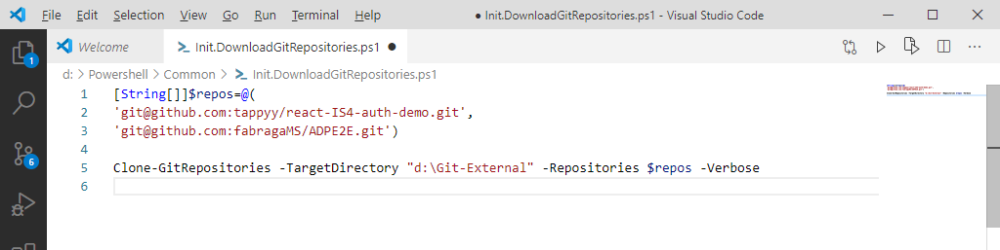
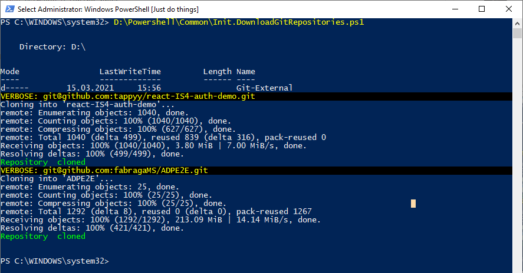

<!--Category:PowerShell--> 
 <p align="right">
    <a href="https://www.powershellgallery.com/packages/ProductivityTools.PSDisplayPosition/"></a>
    <a href="http://www.productivitytools.tech/display-position/"><a> 
    <a href="https://github.com/pwujczyk/ProductivityTools.PSDisplayPosition"></a>
</p>
<p align="center">
    <a href="http://http://productivitytools.tech/">
        
    </a>
</p>

# Clone Git Repositories

Module allows to copy list of repositories to given location. 

<!--more-->
It helps me to store links to all external git repositories which I am interested in, so I can remove them anytime without worrying that I will lose them. 

I created file which contains all repositories and invocation of it.
<!--og-image-->


And now anytime I can just invoke script to download all resources




```PowerShell
[String[]]$repos=@(
'git@github.com:tappyy/react-IS4-auth-demo.git',
'git@github.com:fabragaMS/ADPE2E.git')

Clone-GitRepositories -TargetDirectory "d:\Git-External" -Repositories $repos -Verbose

```


